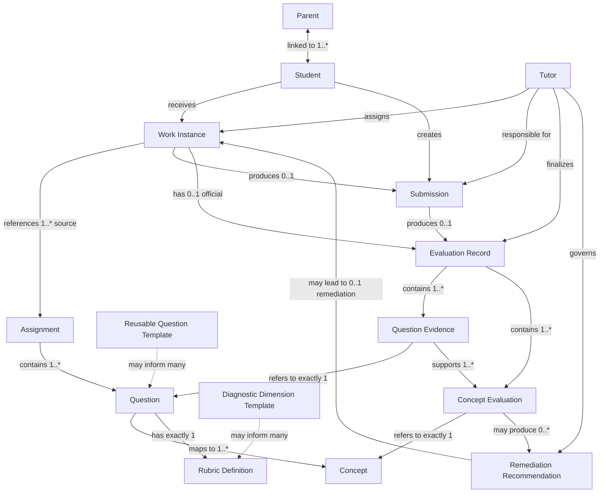

# Domain Diagram

Source: `PRD.md` Section 6, `Domain Model (Core Entities & Relationships)`

```mermaid
flowchart TD
    Assignment[Assignment]
    Question[Question]
    Concept[Concept]
    Rubric[Rubric Definition]
    RQT[Reusable Question Template]
    DDT[Diagnostic Dimension Template]
    Student[Student]
    Tutor[Tutor]
    Parent[Parent]
    WorkInstance[Work Instance]
    Submission[Submission]
    EvaluationRecord[Evaluation Record]
    QuestionEvidence[Question Evidence]
    ConceptEvaluation[Concept Evaluation]
    RemediationRecommendation[Remediation Recommendation]

    Assignment -->|contains 1..*| Question
    Question -->|maps to 1..*| Concept
    Question -->|has exactly 1| Rubric
    RQT -.->|may inform many| Question
    DDT -.->|may inform many| Rubric

    Tutor -->|assigns| WorkInstance
    Student -->|receives| WorkInstance
    WorkInstance -->|references 1..* source| Assignment

    Student -->|creates| Submission
    Tutor -->|responsible for| Submission
    WorkInstance -->|produces 0..1| Submission

    Submission -->|produces 0..1| EvaluationRecord
    WorkInstance -->|has 0..1 official| EvaluationRecord
    Tutor -->|finalizes| EvaluationRecord

    EvaluationRecord -->|contains 1..*| QuestionEvidence
    EvaluationRecord -->|contains 1..*| ConceptEvaluation

    QuestionEvidence -->|refers to exactly 1| Question
    ConceptEvaluation -->|refers to exactly 1| Concept
    QuestionEvidence -->|supports 1..*| ConceptEvaluation

    ConceptEvaluation -->|may produce 0..*| RemediationRecommendation
    Tutor -->|governs| RemediationRecommendation
    RemediationRecommendation -->|may lead to 0..1 remediation| WorkInstance

    Parent <-->|linked to 1..*| Student
```
