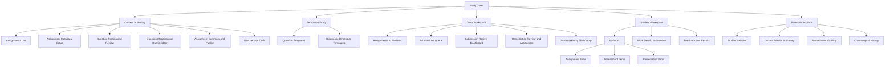

# Information Hierarchy Diagram

Source: `PRD.md` Section 7, `Information Architecture`

```mermaid
flowchart TD
    App[StudyTracer]

    App --> CA[Content Authoring]
    App --> TL[Template Library]
    App --> TW[Tutor Workspace]
    App --> SW[Student Workspace]
    App --> PW[Parent Workspace]

    CA --> CA1[Assignments List]
    CA --> CA2[Assignment Metadata Setup]
    CA --> CA3[Question Parsing and Review]
    CA --> CA4[Question Mapping and Rubric Editor]
    CA --> CA5[Assignment Summary and Publish]
    CA --> CA6[New Version Draft]

    TL --> TL1[Question Templates]
    TL --> TL2[Diagnostic-Dimension Templates]

    TW --> TW1[Assignments to Students]
    TW --> TW2[Submissions Queue]
    TW --> TW3[Submission Review Dashboard]
    TW --> TW4[Remediation Review and Assignment]
    TW --> TW5[Student History / Follow-up]

    SW --> SW1[My Work]
    SW --> SW2[Work Detail / Submission]
    SW --> SW3[Feedback and Results]

    SW1 --> SW1A[Assignment Items]
    SW1 --> SW1B[Assessment Items]
    SW1 --> SW1C[Remediation Items]

    PW --> PW1[Student Selector]
    PW --> PW2[Current Results Summary]
    PW --> PW3[Remediation Visibility]
    PW --> PW4[Chronological History]
```
