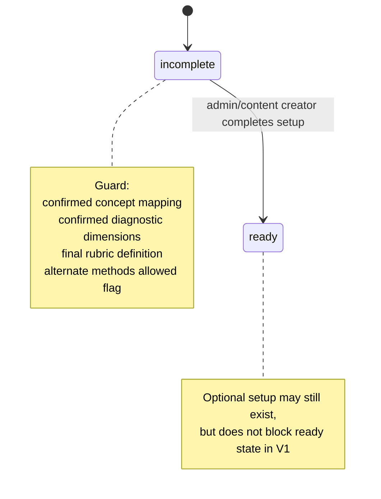

# Question Lifecycle Diagram

Source: `PRD.md` Section 8, `Lifecycle and State Model`

```mermaid
stateDiagram-v2
    [*] --> incomplete
    incomplete --> ready: admin/content creator completes setup

    note right of incomplete
      Guard:
      confirmed concept mapping
      confirmed diagnostic dimensions
      final rubric definition
      alternate methods allowed flag
    end note

    note right of ready
      Optional setup may still exist,
      but does not block ready state in V1
    end note
```
