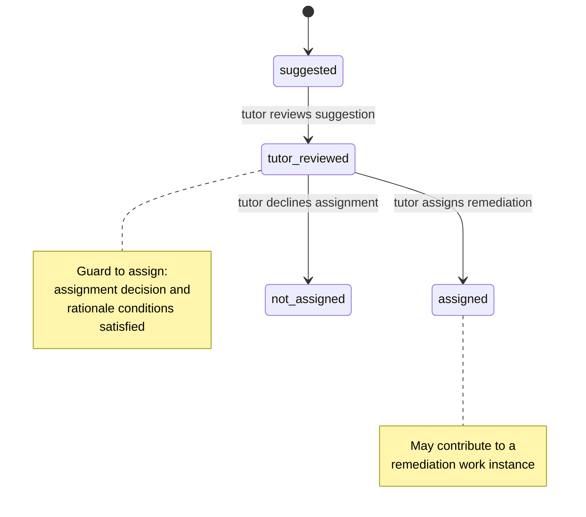

# Remediation Recommendation Lifecycle Diagram

Source: `PRD.md` Section 8, `Lifecycle and State Model`

```mermaid
stateDiagram-v2
    [*] --> suggested
    suggested --> tutor_reviewed: tutor reviews suggestion
    tutor_reviewed --> assigned: tutor assigns remediation
    tutor_reviewed --> not_assigned: tutor declines assignment

    note right of tutor_reviewed
      Guard to assign:
      assignment decision and
      rationale conditions satisfied
    end note

    note right of assigned
      May contribute to a
      remediation work instance
    end note
```
