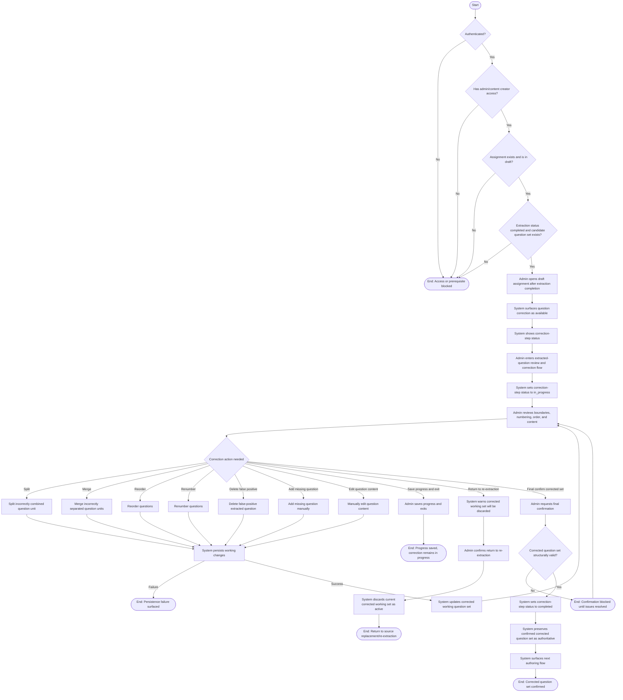

# Review and Correct Extracted Questions User Flow Diagram

Source: [PRD.md](/Users/bubusharma/deepanshu_projects/software-projects-prompts/PRD.md:1267) Section `9.1 Authoring and Publish`, `UF-03: Review and Correct Extracted Questions`

## Diagram Notes

- Actor: `Admin/Content Creator`
- Preconditions enforced in the diagram:
  - authenticated user
  - `admin/content creator` access
  - target `Assignment` exists and is in `draft`
  - extraction status is `completed`
  - candidate extracted `Question` set exists
- Supported correction actions:
  - split
  - merge
  - reorder
  - renumber
  - delete false positives
  - add missing questions
  - manually edit question content
- Working changes persist during editing and support save-progress.
- Manual content edits become authoritative question content.
- Final confirmation requires structural validity:
  - at least one question exists
  - each question has authoritative content
  - each question has final number/order for this stage
  - no unresolved split/merge placeholder artifacts remain
- All questions remain `incomplete` after this flow.
- Returning to re-extraction is destructive to the active corrected working set and requires explicit warning.
