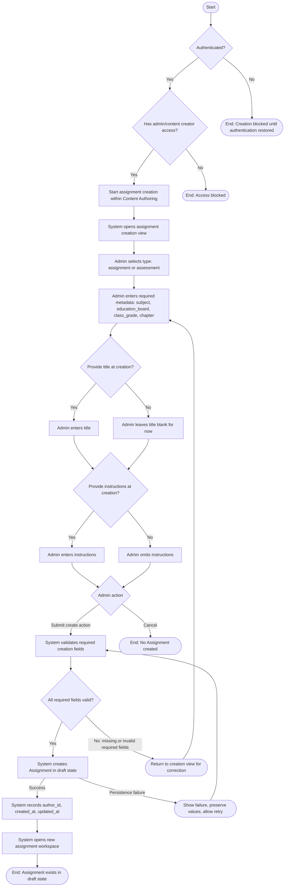

# UF-01 User Flow Diagram

Source: [PRD.md](/Users/bubusharma/deepanshu_projects/software-projects-prompts/PRD.md:1032) Section `9.1 Authoring and Publish`, `UF-01: Create Assignment Draft`

## Diagram Notes

- Actor: `Admin/Content Creator`
- Creation-time required metadata: `type`, `subject`, `education_board`, `class_grade`, `chapter`
- Creation-time optional metadata: `title`, `instructions`
- Explicit alternate paths shown:
  - `AP-01`: title provided at creation
  - `AP-02`: title omitted until later
  - `AP-03`: instructions provided at creation
  - `AP-04`: instructions omitted
- `overall_concepts_tested` is intentionally excluded from this flow and is populated later after question parsing.
- No pre-create draft is persisted before successful validation and creation.
