# Upload Assignment Source and Extract Questions User Flow Diagram

Source: [PRD.md](/Users/bubusharma/deepanshu_projects/software-projects-prompts/PRD.md:1114) Section `9.1 Authoring and Publish`, `UF-02: Upload Assignment Source and Extract Questions`

```mermaid
flowchart TD
    start([Start])
    auth{Authenticated?}
    role{Has admin/content creator access?}
    assignment{Assignment exists and is in draft?}
    open[Admin opens draft assignment in authoring context]
    uploadchoice[Admin chooses to upload assignment source]
    mode{Choose one ingestion mode}
    pdf[Upload single PDF]
    images[Upload multiple images]
    mixed[Attempt mixed PDF and images]
    uploadvalid{Upload packet valid?}
    persist[System persists uploaded source packet]
    preserveorder[System preserves source upload/page order]
    review[System presents uploaded source for pre-extraction review]
    reviewaction{Admin action before extraction}
    startjob[Admin explicitly starts extraction]
    asyncjob[System creates async extraction job]
    inprogress[System sets extraction status to in_progress]
    background[System runs AI extraction in background]
    extracted{Any candidate question units extracted?}
    createquestions[System creates candidate Question records]
    markincomplete[System marks all Questions as incomplete]
    preserveextracted[System preserves extracted candidate question order]
    flags[System flags low-confidence, ambiguous, or numbering-uncertain results]
    attach[System attaches candidate question set to draft assignment]
    completed[System sets extraction status to completed]
    nextstep[System surfaces next review flow availability]
    success([End: Candidate question set ready for review])

    blocked([End: Access or draft-state blocked])
    invalidupload([End: Upload rejected])
    failed([End: Extraction failed, retry available])
    keptforlater([End: Uploaded source kept, extraction not started])
    removed([End: Source removed, no pending ingestion input])
    replaced[Admin uploads replacement source packet]

    start --> auth
    auth -- No --> blocked
    auth -- Yes --> role
    role -- No --> blocked
    role -- Yes --> assignment
    assignment -- No --> blocked
    assignment -- Yes --> open
    open --> uploadchoice
    uploadchoice --> mode

    mode -- Single PDF --> pdf
    mode -- Multiple images --> images
    mode -- Mixed packet attempt --> mixed
    mixed --> invalidupload

    pdf --> uploadvalid
    images --> uploadvalid

    uploadvalid -- No --> invalidupload
    uploadvalid -- Yes --> persist
    persist --> preserveorder
    preserveorder --> review
    review --> reviewaction

    reviewaction -- Exit and keep source --> keptforlater
    reviewaction -- Remove upload --> removed
    reviewaction -- Replace upload --> replaced
    replaced --> mode
    reviewaction -- Start extraction --> startjob

    startjob --> asyncjob
    asyncjob --> inprogress
    inprogress --> background
    background --> extracted

    extracted -- No --> failed
    extracted -- Yes --> createquestions
    createquestions --> markincomplete
    markincomplete --> preserveextracted
    preserveextracted --> flags
    flags --> attach
    attach --> completed
    completed --> nextstep
    nextstep --> success
```

## Diagram Notes

- Actor: `Admin/Content Creator`
- Preconditions enforced in the diagram:
  - authenticated user
  - `admin/content creator` access
  - target `Assignment` exists and is in `draft`
- Source packet mode per ingestion attempt:
  - one PDF
  - multiple images
  - mixed mode rejected
- Extraction is asynchronous and uses assignment-level workflow status:
  - `not_started`
  - `in_progress`
  - `completed`
  - `failed`
- Concept mapping and rubric generation are intentionally excluded from `UF-02`.
- Success means a non-zero candidate question set exists for the next review flow, even if some extracted questions are flagged.
